<p align="center">
  
</p>

<p align="center">
  
  
  
  
  
  
</p>

<p align="center">
  
</p>

<h1 align="center" style="color:#1793D1;">Do Linux the Arch Way!</h1>
<p align="center">Don’t just use Linux — <strong>command it</strong>.</p>

<p align="center">
  
</p>

---

<p align="center">`v01dsh3ll` the Mustang Darkhorse in the Linux multiverse — this LinuxBox breathes elegance and bleeds entropy.</p>

---

## Principle: 🔗 <a href="https://en.wikipedia.org/wiki/KISS_principle">KISS</a>


---

## Highlights of the System

<p align="center">
  <table>
    <thead>
      <tr>
        <th>Component</th>
        <th>Purpose</th>
        <th>Strategic Advantage</th>
      </tr>
    </thead>
    <tbody>
      <tr>
        <td> Full-Disk Encryption</td>
        <td>LUKS2 with keyfile + passphrase</td>
        <td>Mitigates physical compromise and enables unattended boot on trusted hardware</td>
      </tr>
      <tr>
        <td> TPM2 Integration</td>
        <td>TPM-bound keyfile unlock</td>
        <td>Hardware-bound secrets eliminate passphrase reuse & support measured boot</td>
      </tr>
      <tr>
        <td> Secure Boot + UKI</td>
        <td>GRUB with signed kernel support</td>
        <td>Ensures boot integrity, defends against tampering and Evil Maid attacks</td>
      </tr>
      <tr>
        <td> LVM + Btrfs Layout</td>
        <td>Logical volumes + immutable subvolumes</td>
        <td>Enables flexible snapshotting, compression, and disaster recovery</td>
      </tr>
      <tr>
        <td> Snapshot Strategy</td>
        <td>snapper / timeshift + rsync hooks</td>
        <td>Rollback support for system upgrades, backup integrity, and ransomware resilience</td>
      </tr>
      <tr>
        <td> AppArmor + Auditd</td>
        <td>Mandatory Access Control + system logging</td>
        <td>Proactive threat visibility and containment for services & network daemons</td>
      </tr>
      <tr>
        <td> Vault Sync/Restore</td>
        <td>GPG-encrypted archive with rclone + TUI</td>
        <td>Secure secrets backup with Smartcard, dry-run, and CI-friendly hooks</td>
      </tr>
      <tr>
        <td> Kernel </td>
        <td>Linux + Linux LTS (default)</td>
        <td>Stability-first boot with fallback & rapid recovery on regression</td>
      </tr>
    </tbody>
  </table>
</p>

---

## Future Enhancements

| Feature                                  | Status | Description |
|------------------------------------------|--------|-------------|
| 📊 Loki & Grafana                        | ⏳     | Real-time log aggregation, dashboarding, and streaming analytics for `v01dsh3ll`’s heartbeat |
| 🤖 Discord Bots                          | ⏳     | Security alerts from AppArmor, wireguard, Media & backup status, remote triggers |
| ☁️ Private Cloud                         | ⏳     | Nextcloud or Immich backed by `/Pantheon` with Btrfs snapshots and secure remote access |
| 💃 Streaming Service                     | ⏳     | Jellyfin + Emby + Navidrome + Dolby HDR + HW Transcoding + FLAC streaming + Tailscale |
| 🧠 Playlists & Tagging                   | ⏳     | Smart content sorting using ML, mood tags, and automated recommendation systems |
| 🎥 Live Sports                           | ⏳     | (Telly + IPTV) via M3U & Emby integration with EPG and match auto-highlights |

---

## Boot Chain Flow


---

## Partition Layout (`LUKS2` + `LVM` + `Btrfs`)
```plaintext
nvme0n1
 nvme0n1p1  /efi        (FAT32)
 nvme0n1p2  
   └─cryptarch
      ├─vg0-root  →  /       (Btrfs @)
      ├─vg0-home  →  /home   (Btrfs @home)
      ├─vg0-var   →  /var    (Btrfs @var)
      ├─vg0-tmp   →  /tmp    (Btrfs @tmp)
      └─vg0-swap  →  [SWAP]
```

---

## Storage Expansion: `/Data` and `/Pantheon`


- 📅 Uses same keyfile for unlocking all encrypted drives  
- 🔗 Smart bind mounts from `/Data/Music` to `~/Music`, etc.
- 🏛️ `/Pantheon` 20TB for Private Cloud and Media Archive.

---

## Encryption & TPM Unlock Flow


- 🔑 Auto-unlocks using the same TPM-sealed keyfile as root  
- 🔐 Keyfile sealed to TPM2 — no USBs, no interaction, hardware-bound security  
- 🗝️ Decryption Process — Combines passphrase (boot-time fallback) and TPM-unsealed keyfile  

---


## Snapshot & Backup Strategy

```mermaid
flowchart TD
    Update[System Install / Update] --> Snap[snapper or timeshift]
    Snap --> Local[Local Snapshot: /.snapshots]
    Local --> Rsync[🔁 Rsync/Btrbk Sync]
    Rsync --> External[/mnt/Backup - 1TB Drive/]
    External --> Offsite[Cloud / NAS Backup]
```


---

## Vault Sync & Secrets Recovery


- 🔐 Smartcard + Agent-aware  
- 🔄 Dry-run mode for testing restores  
- 🔢 SHA256 checksum before + after upload  
- 🚮 Secure wipe after encryption  
- 📅 Cron-ready automation lines  
- 🏢 TUI menu for restore + backup

---

#### 😂 HUMOR!

> **Why did I ran `rm -rf /`?**  
> _Inner peace comes from letting go._

> **"Ubuntu walks into a bar."**  
> _Arch compiles its own bar from source._

> **"Who needs therapy when you can `makepkg`?"**  
> _Self-healing via compiling._

> **"Why did the Archer cross the road?"**  
> _To compile the kernel on the other side._ 

> **"How many Archer does it take to screw in a lightbulb?"**  
> _None. They rebuild the house and document it in Markdown._ 

> **"Why did the Fedora get dumped by his Arch girlfriend?"**  
> _Too many updates. Not enough commitment._ 

> **"What's an Archer's idea of a romantic evening?"**  
> _By candlelight, the kernel recompiled. DKMS drivers for nVidia rebuilb in silence, while [“Seeing In The Dark”](https://www.youtube.com/watch?v=-2dADSn8vg8&list=PLxG-KbBWHU82fpu9LNrBMcgebDgZ1p5XL) played in 320kbps FLAC - pulsed through ALSA, MPD, CamillaDSP, and ncmpcpp._ 🕯️🎵🎧

---

#### 📚 READ!

> 🔗 [Arch Wiki](https://wiki.archlinux.org/)

#### 🆘 HELP!

> 🔗 [RTFM](https://en.wikipedia.org/wiki/RTFM)  
> 🔗 [Arch Linux Forums](https://bbs.archlinux.org/index.php)  
> 💙 The Arch community loves you even if you pipe `curl | sh` without reading the man pages.

#### 🧢 SWAG!

> `pacman -Syu` — is love.  
> `rm -rf /` — is a lesson.  
> `whoami` — not your fucking business.

---

<p align="center">
  <strong>™️ Notice</strong><br>
  <em>Arch Logo</em> is the trademarks of
  <a href="https://zeroflux.org/">Judd Vinet</a> and
  <a href="https://www.leventepolyak.net/">Levente Polyák</a>.<br>
</p>

---
